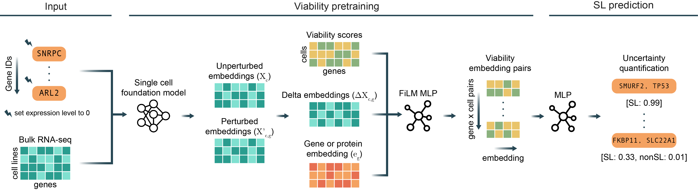

# Overview of Cilantro-SL


Cilantro-SL is a two-stage framework for predicting SL gene pairs that decouples viability-aware single-gene KO representation learning from pairwise SL classification with conformal calibration for rigorous uncertainty quantification. This separation allows the model to first learn transferable perturbation-aware representations and then reuse them flexibly for generalization tasks.
1. **Viability pretraining:** Utilizes a scFM, Geneformer, to generate perturbed and unperturbed embeddings for (cell x gene) combinations to construct a *delta embedding*. The delta embedding is then conditioned on a gene embedding through feature-wise linear modulation (FiLM) to predict gene knockout viability, creating a *viability embedding*.
2. **SL classification:** Takes in a pair of viability embeddings to predict SL/non-SL relationships with calibrated uncertainty measurements through conformal prediction. Classifier scores are converted into calibrated outputs via conformal prediction with corresponding confidence scores, yielding high-confidence SL candidates for experimental testing.


# Running Cilantro-SL
## Input data 
Cilantro-SL requires viability scores for each (cell x gene) KO combination as well as bulk RNA-seq data for each cell line. In addition to this, Cilantro-SL can take in an additional gene prior to condition on, such as Gene2vec embeddings.
1. The viability scores and RNA-seq data should be two pandas DataFrames with cell lines as the index and gene ensembl IDs as the column
2. The gene prior should be a mapping from ensembl IDs to a gene embedding, and will be concatenated with a DataFrame of viability embeddings

## Installation
### Step 1: Create a Conda Environment
We recommend using **Anaconda** to manage your environment. If you haven't already, refer to the [Anaconda webpage](https://www.anaconda.com/) for installation instructions.

Create a Python 3.12.4 environment using the following command:
```
conda env create -f cilantro_sl.yml
```
Activate the environment:
```
conda activate cilantro_sl
```

## Running the code
The bulk RNA-seq data must be tokenized into a 2048-length rank-value encoding via Geneformer. The corresponding unperturbed and perturbed embeddings can be extracted using `isp/perturb_2048_SL.py` and `input_setup/data_generator.py` to parse the individual (cell x gene) embeddings into delta embeddings.

Next, concatenate this data with any additional gene priors and viability score information to create a pandas DataFrame. The final format of the data have index `('cell line name', 'gene ensembl ID')`. The first 512 columns must be the delta embedding, followed by columns containing the gene embedding, and the last column must be titled `'viability score'` and contain the corresponding viability score for the gene and cell KO.

To run Cilantro-SL, use the following command:
```
python run_cilantro_sl.py
```
This will:
1. Conduct pretraining on the delta embedding and any gene prior to produce viability embeddings
2. Train the SL classifier using generated viabilty embeddings and create calibrated prediction sets and confidence score on testing samples